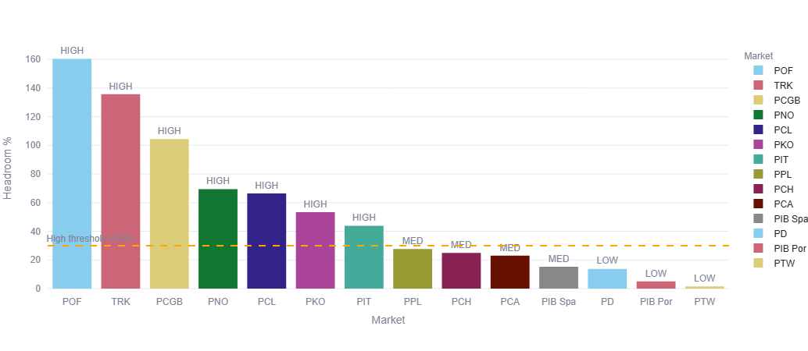
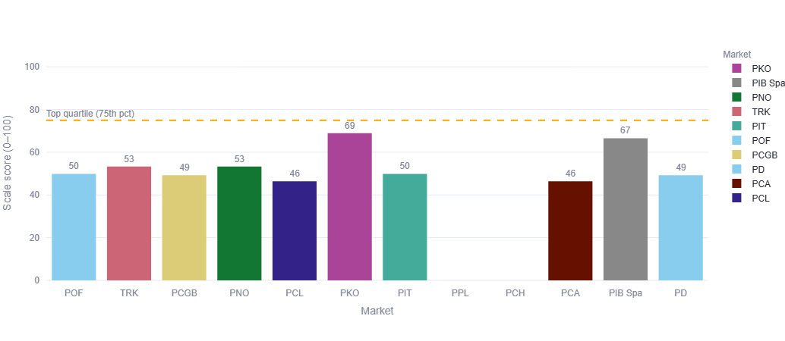
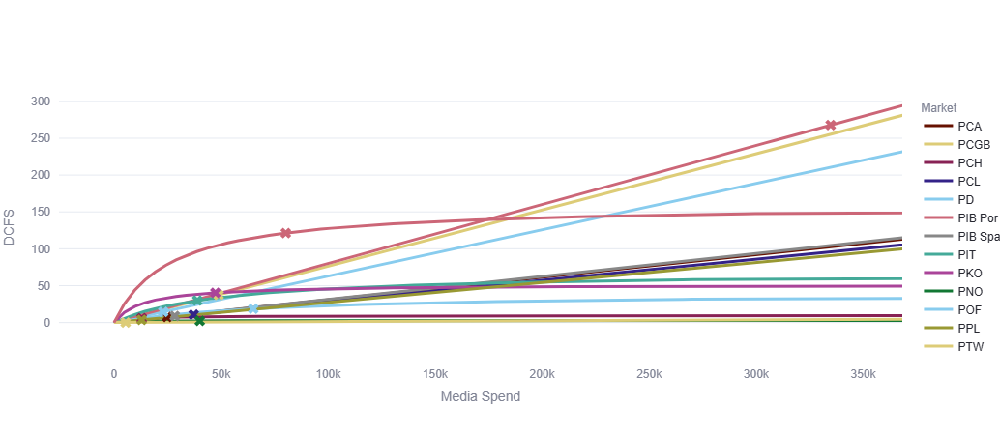

# Close the Gap  
## Budget Allocation Report  

---

## 1. Scope  

| Dimension | Coverage |
|------------|----------|
| **Markets** | PCA, PCGB, PCH, PCL, PD, PIB Por, PIB Spa, PIT, PKO, PNO, POF, PPL, PTW, TRK |
| **Channels** | Paid Search, Paid Social |
| **Models** | Cayenne, Macan, Panamera, Taycan, Range (Mixed) |
| **Campaigns** | Panamera & Cayenne Close the Gap, Winning BEV Close the Gap |
| **Time Basis** | Calendar week |

---

## 2. Allocation Framework  

Budget distribution is determined by three performance drivers.

| Driver | Description | Purpose |
|----------|-------------|-----------|
| **Spend Response** | Market-specific response curves based on historical DCFS vs spend | Identifies incremental return potential and avoids saturation |
| **Efficiency Headroom** | Current CPL vs benchmark (25th percentile reference) | Detects efficiency improvement opportunity |
| **Scale** | Recent DCFS volume ranking within channel | Assesses market capacity to absorb additional investment |

The final allocation blends performance optimisation and strategic steering.

| Parameter | Setting |
|------------|----------|
| Headroom Strength | 1.00 |
| Scale Strength | 1.00 |
| Constraint Strength | 0.50 (50% optimisation / 50% steering) |
| Minimum Spend Applied | Yes |
| Minimum Spend Total | €70,000 |
| Total Budget | €800,000 |
| Curves Fitted | 14 |

---

## 3. Impact Comparison  

| Scenario | Projected DCFS |
|------------|----------------|
| Pure Spend Optimisation | 722.27 |
| Balanced Allocation | 568.26 |

Pure optimisation would concentrate nearly 90% of budget in a single market.  
The balanced allocation distributes investment while preserving primary growth engines.

---

## 4. Final Budget Distribution  

| Market | Allocation (€) | Share |
|----------|---------------|--------|
| **PIB Por** | 334,823.99 | 41.85% |
| **TRK** | 80,242.53 | 10.03% |
| **POF** | 65,059.46 | 8.13% |
| **PCGB** | 48,889.75 | 6.11% |
| **PKO** | 47,356.19 | 5.92% |
| **PNO** | 40,058.69 | 5.01% |
| **PIT** | 38,904.90 | 4.86% |
| **PCL** | 37,223.87 | 4.65% |
| **PIB Spa** | 28,365.55 | 3.55% |
| **PCA** | 24,832.66 | 3.10% |
| **PD** | 22,995.85 | 2.87% |
| **PCH** | 12,945.46 | 1.62% |
| **PPL** | 12,884.32 | 1.61% |
| **PTW** | 5,416.77 | 0.68% |
| **Total** | **800,000.00** | **100%** |

---

## 5. Allocation Interpretation  

PIB Por remains the primary investment focus due to strong scale and return capacity.  
TRK and POF represent the next largest expansion opportunities.  
PCGB, PKO and PNO reflect clear efficiency and scale balance.  
Smaller markets retain controlled presence to support performance development and learning.

---

## 6. Summary  

The €800,000 allocation reflects:

- Incremental return potential  
- Efficiency improvement opportunity  
- Market scalability  
- Controlled concentration risk  

The framework allows recalibration as performance evolves while maintaining structured capital deployment across markets.
